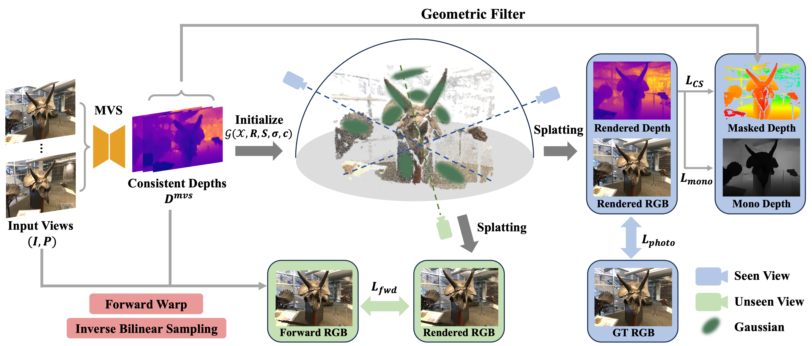

# MVPGS
MVPGS is a few-shot novel view synthesis method based on 3D Gaussian Splatting. Details are described in our paper:
> MVPGS: Excavating Multi-view Priors for Gaussian Splatting from Sparse Input Views
>
> Wangze Xu, Huachen Gao, Shihe Shen, Rui Peng, Jianbo Jiao, Ronggang Wang
>
> ECCV 2024 ([arxiv](https://arxiv.org/abs/2409.14316) | [project page](https://zezeaaa.github.io/projects/MVPGS/))

<p align="center">
    
</p>

📍 If there are any bugs in our code, please feel free to raise your issues.

## ⚙ Setup
#### 1. Recommended environment
```
# clone this repository
git clone https://github.com/zezeaaa/MVPGS.git --recursive # or  git clone git@github.com:zezeaaa/MVPGS.git --recursive
# create environment
conda env create --file environment.yml
conda activate mvpgs
```
#### 2. LLFF Dataset

- Download LLFF from [the official download link](https://drive.google.com/drive/folders/128yBriW1IG_3NJ5Rp7APSTZsJqdJdfc1), unzip to `<your LLFF path>`.

#### 2. DTU Dataset

- Download DTU dataset  `Rectified (123 GB)` from the [official website](https://roboimagedata.compute.dtu.dk/?page_id=36/), unzip to `<your DTU_Rectified path>`.
- Download masks `submission_data.zip` (used for evaluation only) from [this link](https://drive.google.com/file/d/1Yt5T3LJ9DZDiHbtd9PDFNHqJAd7wt-_E/view?usp=sharing), unzip to `<your DTU_mask path>`, then run
  ```
  # Set original_dtu_path as <your DTU_Rectified path>
  # Set output_path as <your DTU path>
  bash scripts/prepare_dtu_dataset.sh
  ```
  then the preprocessed DTU colmap dataset is generated in `<your DTU path>`. The data structure is just like this:
  ```
  <your DTU path>                          
    ├── scan8
      ├── distorted
      ├── images
      ├── images_2
      ├── images_4
      ├── images_8
      ├── sparse
      ├── stereo
      └── poses_bounds.npy
    ├── scan21
    ├── ...
  ```
#### 3. NVS-RGBD Dataset
- Download NVS-RGBD from the [official website link](https://drive.google.com/drive/folders/1gDVZomm0AGpgIja19Lbg4oJQmvHB30rB?usp=sharing), unzip to `<your NVS-RGBD path>`.
- To get all cameras in colmap format, run
  ```
  # set dataset_path as <your NVS-RGBD path>
  bash scripts/get_all_cams_for_nvsrgbd.sh
  ```

#### 4. Tanks and Temples Dataset
- Download Tanks and Temples dataset preprocessed by [NoPe-NeRF](https://nope-nerf.active.vision/) from [this link](https://www.robots.ox.ac.uk/~wenjing/Tanks.zip), unzip to `<your T&T path>` (we use the first 50 frames of each scene for our experiments).

## 📊 Testing

#### 1. Download the pretrained models
Download the official pretrained [MVSFormer](https://github.com/ewrfcas/MVSFormer) weights (`MVSFormer.zip` and `MVSFormer-Blended.zip`) from the [official link](OneDrive). Extract the pretrained models to `./pretrained/`.

#### 2. LLFF testing
Training and evaluation on LLFF:
```
# set data_path as <your LLFF path>
bash scripts/exps_llff.sh
```
#### 3. DTU testing
Training and evaluation on DTU:
```
# set data_path as <your DTU path>
# set dtu_mask_path as <your DTU_mask path>
bash scripts/exps_dtu.sh
```

#### 4. NVS-RGBD testing

Training and evaluation on NVS-RGBD:
```
# set data_path as <your NVS-RGBD path>
bash scripts/exps_nvsrgbd.sh
```
#### 5. Tanks and Temples testing
Training and evaluation on T&T:
```
# set data_path as <your T&T path>
bash scripts/exps_tanks.sh
```


## ⚖ Citation
If you find our work useful in your research please consider citing our paper:
```
@inproceedings{xwz2024eccv,
  title={MVPGS: Excavating Multi-view Priors for Gaussian Splatting from Sparse Input Views},
  author={Wangze Xu, Huachen Gao, Shihe Shen, Rui Peng, Jianbo Jiao, Ronggang Wang},
  booktitle={The 18th European Conference on Computer Vision (ECCV)},
  year={2024}
}
```

## 👩‍ Acknowledgements

Our code is heavily base on [3D Gaussian Splatting](), and we use the rasterization in [DreamGaussian](https://github.com/ashawkey/diff-gaussian-rasterization). We refer to [Pose-Warping](https://github.com/NagabhushanSN95/Pose-Warping) for the forward warping implementation, and we use [MVSFormer](https://github.com/ewrfcas/MVSFormer) for the prediction of MVS depth. We thank the excellent code they provide.
